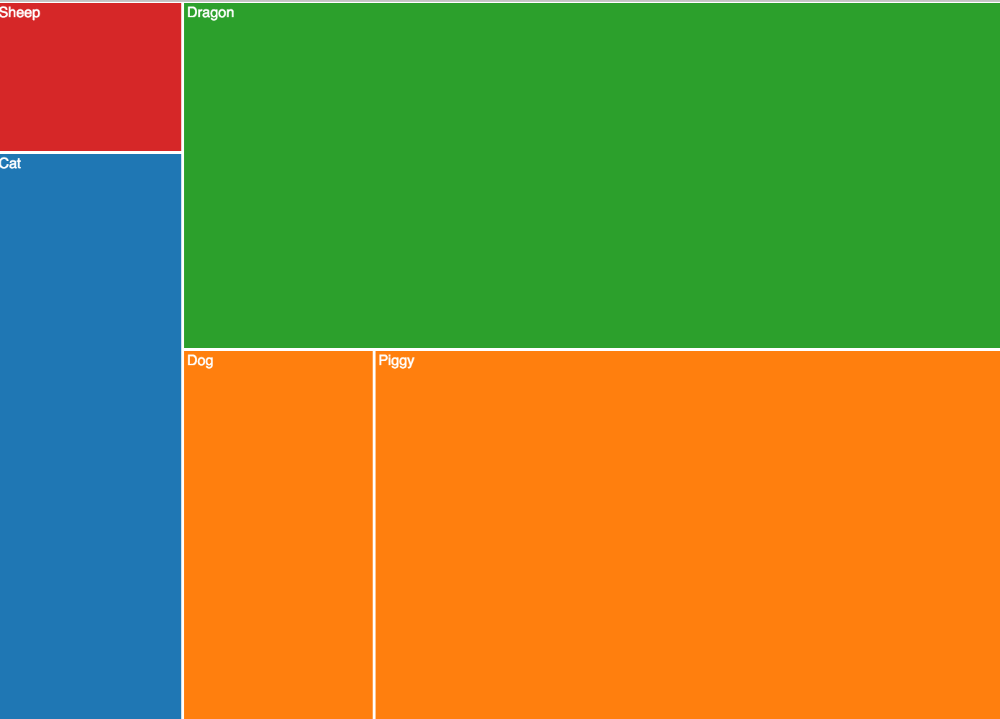

# viz-software-design

## Introduction
For this assignment, you will learn how to use a reusable treemap chart. Treemaps display data in a rectangular and categorical format.

## Data Format
The format of the data is important in order to properly use the treemap layout. There are 3 variables you can change when using this software: `grouping`, `selectedDisplay`, and `measure`.

### grouping
`Grouping` is the variable that will cluster or categorize your data by color. The data types should be strings that identify different types of categories. For example, in the example above, there are 4 genders identified, hence 4 colors.

### selectedDisplay
`selectedDisplay` is the variable that will display the text for each square, identifying the subject being displayed. For example, in the example above, types of animals belonging to each gender are reflected.

### measure
`Measure` is the numerical unit that will determine the size of the square in each grouping. The data types should be integers that reflect some sort of total or numerical representation. For example, in the example above, the square sizes are based on the number of animals that belong to each gender.

## Implementation
Now that your data is in the right format, be sure to put the file in the `data` folder and have the correct file path in the `main.js`.

The following methods can be used to implement and customize your treemap:

- Tree()

	> Creates an instance of the Tree

- Tree.height(number)

	> Constructs a Tree object with the height value set to `number`

- Tree.width(number)

	> Constructs a Tree object with the width value set to `number`

- Tree.color(color category)

	> Constructs a Tree object with the color value set to a type of color category.

- Tree.measure(number)

	> Constructs a Tree object with the measure value set to `number`

- Tree.grouping(string)

	> Constructs a Tree object with the grouping value set to `string`

- Tree.selectedDisplay(string)

	> Constructs a Tree object with the height value set to `string`

